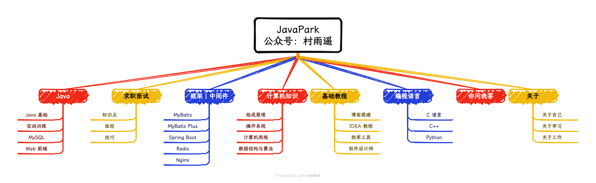

⏰ 在阅读本博客内容时，若遇到任何内容、代码、图片等有关错误，都可以提交 **issues** 或者 **PR** 的方式进行勘误反馈，我会陆续进行完善改进，感谢支持。

- issues: `https://github.com/zzdxy/zzdxy/issues`
- PR: `https://github.com/zzdxy/zzdxy/pulls`，仅需在文章的末尾找到 **在 GitHub 上编辑此页**，即可完成克隆和提交 `PR`。
- 本站为整理公众号文章的知识库，关注公众号：[郴城信息](https://zzdxy.gitee.io/contact/wechatpublic.svg) 及时获取最新推文，避免错过最近更新。
- 此外，如果在学习本站内容有疑惑的地方，还可以通过微信：`8698305` 联系我，备注 **加群**，拉你进技术交流群！

---

## 零、本站知识图谱

---

# highlights:

  # - header: 在这里你能看到以下方面的内容
features:
  - title: Java 教程
    icon: iconfont icon-java
    details: Java 基础保姆级教程
    link: /java-tutorial/
  - title: 求职面试
    icon: iconfont icon-interview
    details: 面试八股、简历修改
    link: /interview/
  - title: 框架｜中间件
    icon: iconfont icon-framework
    details: 各种框架、中间件知识点总结
    link: /framework/
  - title: 计算机基础
    icon: iconfont icon-computer
    details: 网络、算法、数据结构等知识
    link: /cs-wiki/
  - title: 基础教程
    icon: iconfont icon-rocket
    details: IT 相关知识，助力工作学习
    link: /tutorial/
  - title: 编程语言
    icon: iconfont icon-order
    details: 学习其他编程语言的总结
    link: /program-language/
  - title: 你问我答
    icon: fa-solid fa-circle-question
    details: 回复常见疑问
    link: /QA/
    
  - title: 好物周刊
    icon: fa-solid fa-newspaper
    details: 记录每周有价值的信息
    link: /weekly/
  
  - title: 编程分享
    icon: fa-solid fa-newspaper
    details: 分享实战经验
    link: /编程分享/

  - title: 咸鱼
    icon: iconfont icon-fish
    details: 记录每周有价值的信息
    link: /咸鱼/

---

## 必看专栏

-   [Java 基础](/java-tutorial/javase/20220701-intro-to-java/)：适合 `Java` 初学者，结合网上资料加以编写的保姆级教程。
-   [好物周刊](/weekly/2023/0415-0421/)：记录每周看到的有价值的信息，主要针对计算机领域，汇聚项目、软件、网站、插件、资料等方面内容，每周五发布。

---

## 一、Java

## 二、求职面试

## 三、框架｜中间件

## 四、计算机知识

## 五、基础教程

## 六、编程语言

## 七、你问我答

## 八、好物周刊

## 九、编程分享

## 十、关于