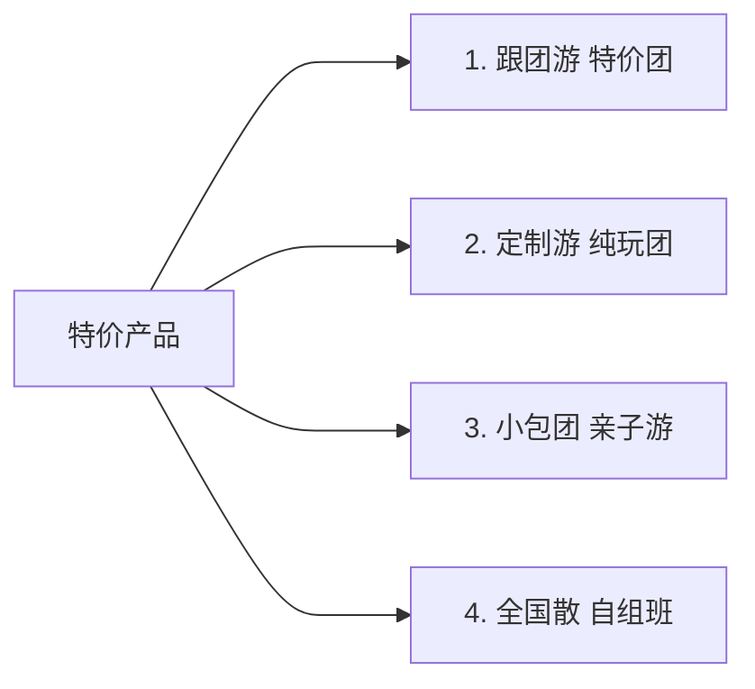

# 五指峰一日游

::: info 共勉
做好品质，终会认可，十分耕耘，一分收货。
:::
::: tip 原文
https://aiyoja.github.io/20241229/

:::

## 一、简介

湖南郴州一手地接    郴州乐景国际旅行社 
现有员工近百名  优秀专职导游一百多名  
承接各类湖南旅游 定制游 小包团 全国散  自组班   纯玩团  特价团  进店团 研学团  考察团  会议团 
      自带车  亲子游   自由行  订酒店  租车  订票    散客天天接，2人就发
2025年被授予携程、飞猪、美团旅游，优质供应商   欢迎联系:  17375197632（微信同号）

## 二、产品详情链接
<h2 id="bd637dce"></h2>
整团报价： 明细表为门市价（仅供参考），包含部分数量为1，不含部分为0，报名优惠价格298

---

| 客户 | 散客 | 联系人 | 17375197632 |
| ---: | :--- | ---: | :--- |
| 报名人数 | 1 大 0 小 | | |
| 线路特色 | 行程特色：天天发团，1人起订， 出游首选：100%纯玩，全程不进店，无购物 精选景点：★赏国家4A级景区-莽山国家森林公园-五指峰景区                  ★观莽山新十景，一索飞渡，上下穿梭，腾云驾雾，可近观五指峰，远眺天台峰                  ★看峰险、水秀、松奇、林幽、泉清、石怪、云幻、雾凇 | | |

| [行程介绍](https://vip2.lyouoa.com/982366/SysManage/QuotationInfo?Id=89357&searchValue=&searchKey=QuotationCode&groupTimeKey=GroupStartTime&StartTime=2025-12-01&EndTime=2025-12-31&IsNew=true&Is2Group=false&page=1&limit=20#xcap) | [费用说明](https://vip2.lyouoa.com/982366/SysManage/QuotationInfo?Id=89357&searchValue=&searchKey=QuotationCode&groupTimeKey=GroupStartTime&StartTime=2025-12-01&EndTime=2025-12-31&IsNew=true&Is2Group=false&page=1&limit=20#fybh) | [服务标准](https://vip2.lyouoa.com/982366/SysManage/QuotationInfo?Id=89357&searchValue=&searchKey=QuotationCode&groupTimeKey=GroupStartTime&StartTime=2025-12-01&EndTime=2025-12-31&IsNew=true&Is2Group=false&page=1&limit=20#fwbz) | [线路备注](https://vip2.lyouoa.com/982366/SysManage/QuotationInfo?Id=89357&searchValue=&searchKey=QuotationCode&groupTimeKey=GroupStartTime&StartTime=2025-12-01&EndTime=2025-12-31&IsNew=true&Is2Group=false&page=1&limit=20#xlbz) |

---

**简化行程**

| 天数 | 行程安排 | 早餐 | 午餐 | 晚餐 | 住宿 |
| :---: | :---: | :---: | :---: | :---: | :---: |
| 第1天 | 郴州五岭广场---莽山·五指峰----郴州五岭广场 | × | × | × | 无 |

---

**行程介绍**

**第1天**

**D1**

**郴州 -> 郴州**

**用餐：**早餐   无   午餐   无   晚餐   无    不含餐（峡谷餐厅可选）   

**住宿：**不含住宿

**门票：** 18-59岁成人-五指峰门票    上下索道（必消）    景区交通车（必消-导游现收）    垂直电梯（摩天岭-小天台）可选    65岁以上、14-17岁门票   

**用车：** 32座   

**导服：** 导服费   

---

**【莽山五指峰景区】**

湖南宜章莽山是地球同纬度保存最完好、物种最丰富的原始森林，是中国南方原始生态第一山、中国南方第一森林氧吧、国家级自然保护区、国家地质公园、湖南省面积最大国家森林公园、国家AAAA级景区、广东省第一高峰，素有“一山跨两省·湘粤在莽山”。【五指峰景区】，由中景信集团的历数三年，巨资投入、超前规划、人性设计、精工建设及匠心打造，南中国最长悬空栈道：总长约8公里，海拔1400米至1600米，两层栈道，全程无障碍观光环线，登高山、临绝壁如履平地，尽享“非人”奇遇。乘坐中国目前最长索道单线的观光缆车【五指峰索道】，索道全长3.7公里，全国单线最长；每小时客运量达2000人，全国功率最大；全球索道极限高差峰索道，上下穿梭，一索飞渡，腾云驾雾，仅需11分钟，就到五指峰核心景区，悬崖栈道，莽山新十景，一一亮相在你眼前。

景区内的崖子石（又名天台山），山势雄伟，气势磅礴，崖险谷幽，奇峰怪石遍布。雨后放晴时节，这时云雾缭绕，晃若人间仙境。这里富含着悠久的文化，不腐女尸之谜更令人神秘莫测。该景区主要有，达1000米，创造了全国乃至全球索道领域的多项第一，堪称“世界一流、中国第一”五指仙掌峰、童子峰、金鞭神柱、伟人会观音、东天门、天南第一险、小华山、仙韭菜坡、杜鹃林、观音堂、天台寺、千年红豆杉等景点。

  

---

**【行程安排】**

8:00 瑞际酒店旁边的长沙银行 门口集合前往宜章莽山【五指峰】景区。

10:30到达【五指峰景区】抵达景区游客服务中心，搭乘景区环保换乘车（车费10元/人往返，此费用不含，需游客自理）10分钟后，到达缆车站，乘坐中国单线最长观光缆车，抵达南中国最高海拔云间栈道（门票+双程往返缆车都已含）开始游览。

12:00准备用中餐（中餐不含，餐费自理）

13:00继续游览上层云间栈道，近距离观看莽山的镇山神柱----金鞭神柱。

15:30集合乘车返回郴州，回到温馨的家！

18:30返回五岭广场散团，建议预订19:30左右的返程高铁。

---
**费用说明**

| 项目 | 使用时间 | 名称 | 类型 | 报价 | 数量 | 报价小计 |
| :---: | :---: | :---: | :---: | :---: | :---: | :---: |
| 用餐 | 第1天 | 不含餐（峡谷餐厅可选） | | 60 | 0 | 0 |
| 门票 | 第1天 | 18-59岁成人-五指峰门票 | | 160 | 1 | 280 |
| | 第1天 | 上下索道（必消） | | 120 | 1 | |
| | 第1天 | 景区交通车（必消-导游现收） | | 10 | 0 | |
| | 第1天 | 垂直电梯（摩天岭-小天台）可选 | | 80 | 0 | |
| | 第1天 | 65岁以上、14-17岁门票 | | 80 | 0 | |
| 用车 | 第1天 | 32座 | | 138 | 1 | 138 |
| 导服 | 第1天 | 导服费 | | 300 | 0 | 0 |

| 明细表为门市价（仅供参考），包含部分数量为1，不含部分为0，报名优惠价格298 | | | | | | |

---

**服务标准**

★【费用包含】

【用餐】全程不含餐，景区内有峡谷餐厅，可提供热食，丰俭由人，客人自理。

【门票】莽山五指峰门票，往返索道缆车。

【交通】全程旅游用车(按实际人数排车，保证一人一正座)；

【导游】10人以上派导游，10人以下司兼导。

【购物】无。

【保险】含旅行社责任险。

★【费用不含】

1、因不可抗力因素所引致的额外费用；

2、因旅游者违约、自身过错、自身疾病导致的人身财产损失而额外支付的费用；

3、个人消费（如酒水、饮料，等未提到的其它服务）；

4、旅游费用包含”内容以外的所有费用及景区小交通所列的未含费用；

5、本行程景区内所涉及的小门票、景区内自费等项目，需自理；

6、如遇特殊情况，我公司有调整行程前后顺序的权利，以不减少报价内容为准，赠送景点如无法正常参观，则听从导游安排。

★【温馨提示】

1、导游会出发前一天晚上18：00左右会以电话或短信的方式通知集合时间和地点，未收到通知的游客请及时跟报名的旅行社取得联系，以免造成遗漏。

2、如24小时内取消位置，收取车损80元/人。

3、我社在不减少景点的情况下，有权利根据实际情况调整景点游览的顺序。

4、景区自2023年1月起，需收取10元景区换乘车费，此费用不含，需游客自理！

5、摩天岭电梯（40元/单程）是景区的加点项目，不是必须消费，导游不会强推！

6、此行程不接受心脏病、高血压、癫痫、饮酒者、孕妇和骨质疏松症等一系列突发性疾病者报名，请游客根据自身健康评估情况酌情报名，如因隐瞒健康状况而在跟团途中发生疾病，由游客自行负责后果。

---

**线路备注**

注意：预定需提前一天18点前，18点后退改需收车损，出行当天收全损。

**订购流程：**

1.提供出行日期，出行人姓名+身份证号，联系人电话

2.费用请扫描行程页二维码，缴费后请截图留存

3.预定成功后，做好出行准备，耐心等待导游发送出行通知，（一般出行前一天，晚上7-9点左右）

4.按照导游通知地点，时间，车牌号，准时上车参团。

---

## 三、总结

上文主要推荐本社近期特价产品，具体发班情况，请详细咨询。

## ⏳ 联系

想解锁更多知识？不妨关注我的微信公众号：**[郴城信息](https://zzdxy.gitee.io/contact/wechatpublic.svg)**。

扫一扫，探索另一个全新的世界。

<Share colorful />